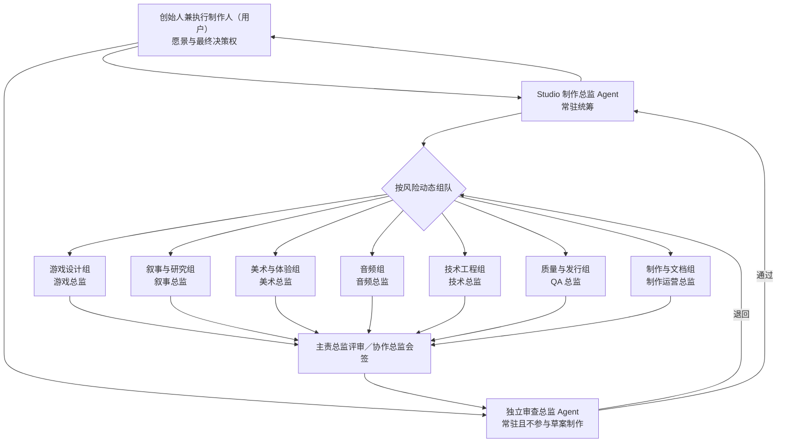
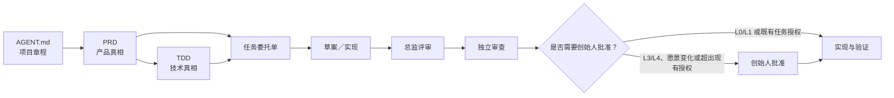

# 《佣书》AI Game Studio

## 治理结构

## 运行原则

- 常驻角色只有 Studio 制作总监与独立审查总监；专业组按任务启用。
- 每项任务只有一个主责组，每个启用组都有一名总监。
- 每份草案先经主责总监评审，再经独立审查；跨组任务需要协作总监会签。
- 独立审查只因错误、遗漏、冲突、不可接受风险或证据不足退回，不以审美偏好否决。
- 创始人是唯一最终决策者。Agent 不得擅自改变愿景、发布、花费、删除重要数据或执行不可逆操作。
- 完整角色、风险等级和输出协议由全局 `$game-studio` Skill 提供；本文件是《佣书》的项目实例说明。

## 交付链

## 《佣书》当前 Studio 基线

- 产品核心：玩家通过搜集、整理、查验、比对、拼接与编纂史料，寻找“真相”，记录历史。
- “真相”不是唯一官方答案；证据的来源、缺失、立场与传播史必须可被玩家观察和判断。
- 当前产品与技术规格分别见 [PRD](../product/PRD.md) 和 [TDD](../technical/TDD.md)。
