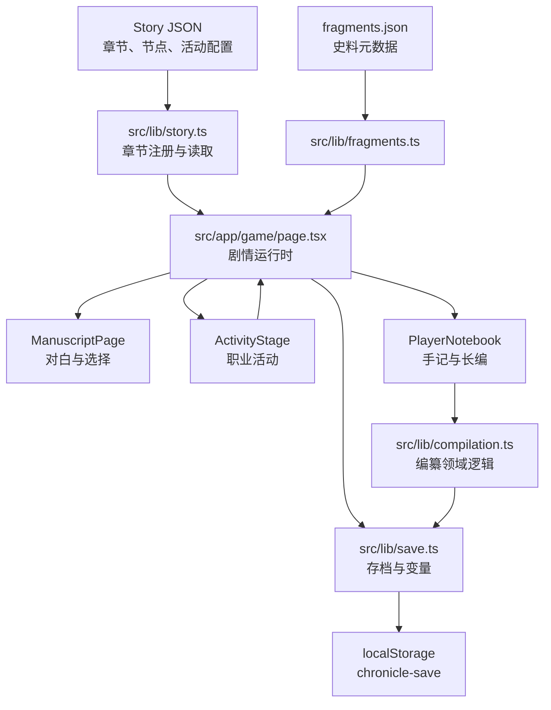

# 《佣书》（Chronicle）技术设计文档

文档版本：1.0

状态：滚动技术主文档；当前实现基线与下一阶段契约

说明：本文中的 TDD 指 Technical Design Document。

## 1. 技术目标

- 用静态可部署的 Web 客户端承载章节制历史互动叙事。
- 让剧情与玩法内容数据化，避免写死在组件中。
- 保证史料处置、玩家判断和跨章后果可持久化、可迁移、可测试。
- 在不引入后端的前提下支持桌面、移动端和 GitHub Pages 发布。
- 以最小充分架构服务当前里程碑，不为未确认章节提前建设平台。

## 2. 当前技术栈

| 层 | 选择 |
|---|---|
| 框架 | Next.js 15 App Router，静态导出 |
| UI | React 19、TypeScript 5.7、CSS／Tailwind CSS 3.4 |
| 数据 | `src/story/*.json` 与 TypeScript 类型契约 |
| 状态 | React 客户端状态＋浏览器 `localStorage` |
| 测试 | Node test runner via `tsx --test`、ESLint、Next production build |
| 发布 | `output: export`，GitHub Pages 条件 `basePath`／`assetPrefix` |

当前无服务端数据库、账号、遥测、云存档或联网运行时依赖。

### 2.1 文档版本策略

本 TDD 随获批里程碑滚动更新，不声称预先定义未知章节的最终架构。触发更新的事件包括：故事 JSON 契约变化、存档结构变化、新运行时服务、目标平台变化、核心活动类型增加或发布闸门变化。每次更新必须维护第 3.1 节状态矩阵，并同步 PRD 与项目章程。

## 3. 系统架构



### 3.1 实现状态矩阵

| 领域 | 状态 | 说明 |
|---|---|---|
| 静态章节运行时 | implemented | 已注册第一章与第二章双路线 |
| 职业活动 | implemented | 分类、查验、比对、拼接、地图、编纂已有实现 |
| 编纂领域约束 | implemented | 永久离手、朱记上限和路线解析有单元测试 |
| 存档迁移 | implemented | `schemaVersion: 1` 封装、v0 迁移、损坏／未来版本安全失败与写入失败提示均已实现并测试 |
| 故事图校验 | implemented | 覆盖章节注册、跨章目标、全图可达性、终点、地点、史料与编纂路由 |
| 历史证据台账 | implemented（P0 基线） | `HIST-001—005` 已完成来源、定位、类别、争议与审校登记；新增断言仍须逐项过门 |
| 浏览器／真机发布证据 | partial | 桌面 Chromium 已走通第一章与第二章双路线；P2 仍需移动真机和多浏览器证据 |

## 4. 代码边界

### `src/types/game.ts`

定义剧情、活动、地图、手记、史料、编纂与存档的公共数据契约。新增 JSON 字段必须先在这里建模，并同步数据测试和迁移。

### `src/story/`

保存剧情与内容数据。React 组件不得包含章节正文。章节注册当前位于 `src/lib/story.ts`；新章节必须显式注册并通过引用校验。

### `docs/research/CLAIMS.md`

作为不暴露给玩家的历史证据 sidecar，避免把研究元数据塞进运行时故事 JSON。每条玩家可见的历史化断言记录：稳定 ID、内容位置、摘要、H1-H4 类别、现实来源、推理备注、争议状态、审校人和审校日期。新增或大幅修改历史内容时，叙事与研究组必须同步台账；发布检查拒绝未审校的 H1/H2。

### 外部研究资料库

外部研究母库根路径只在 `docs/research/SOURCE_LIBRARY.md` 定义，避免迁移机器时多处漂移。运行时游戏不读取该目录；它只服务开发阶段的叙事研究与史料审校。项目通过 `SOURCE_LIBRARY.md` 保存位置、规模、信任层级与检索规则，通过 `CLAIMS.md` 保存实际采用的引用。

资料调用顺序：

1. 根据当前断言生成窄关键词和同义词。
2. 优先用文件名和 `rg` 搜索 `.md`／`.txt` 转写，定位候选文献和段落。
3. 只打开命中的局部文本；需要原文、版式或页码时读取对应 PDF 页面。
4. 将书目信息、文件路径、页码、分类和研究备注写入 `CLAIMS.md`。
5. 由历史研究员核验，叙事总监评审，独立审查总监检查是否支持实际游戏断言。

禁止把整库一次性载入模型上下文。禁止修改、重命名或删除外部资料。AI 生成内容、聊天整理和论文旧版本只能作为检索入口，不能作为 H1/H2 的唯一依据。

### `src/lib/`

- `story.ts`：纯读取和章节注册。
- `save.ts`：存取、初始状态、变量和手记更新。
- `compilation.ts`：史料领域规则与永久状态。
- `fragments.ts`：史料目录访问。
- 其他文件保持单一领域职责，不把 UI 状态混入领域逻辑。

### `src/app/game/page.tsx`

负责运行时编排：加载／标准化存档、定位当前节点、应用节点效果、章节切换、页面历史和持久化。避免继续吸收具体活动 UI；新活动应进入独立组件。

### `src/components/`

负责呈现和本地交互。活动通过明确的结果对象返回领域变化，不直接写 `localStorage` 或修改故事数据。

## 5. 剧情数据模型

`StoryChapter` 包含章节元数据和 `StoryBeat[]`。`StoryBeat.type` 当前支持：

- `dialogue`、`choice`、`title`；
- `sorting`、`inspection`、`comparison`、`assembly`；
- `map`、`compilation`。

节点通过 `next`、选择 `goto`、跨章 `chapter` 和活动结果路由连接。节点还可更新档案、手记、地点和史料授予。

### 数据不变量

- 章节 ID、节点 ID、选择 ID、文档 ID 和史料 ID 在各自命名空间内唯一。
- 所有 `next`／`goto` 指向已注册章节中的有效节点。
- `terminal` 节点不要求后继；非终止节点必须存在可达后继。
- 活动类型必须具有对应配置，且配置不能挂在错误类型上。
- `grantFragments` 和 `compilation.fragmentId` 必须引用存在的史料。
- 编纂路由必须覆盖该节点允许的处置结果。

## 6. 状态与存档

`SaveData` 当前保存章节、节点索引、变量、档案、人物、活动、线索、手记、地点、编纂状态和时间戳。

### 当前流程

1. 新游戏调用 `createInitialSave`。
2. 继续游戏从 `SAVE_KEY = "chronicle-save"` 读取版本封装；无封装旧存档按 v0 处理。
3. `decodeSave` 先解析和校验，再以纯函数迁移到当前 `schemaVersion: 1`。
4. 迁移成功后写回当前封装；损坏、未知未来版本或存储异常不会静默覆盖原数据。
5. 节点提交时计算新状态并写入 `localStorage`，写入失败在界面提示“本次进度未保存”。
6. 章节切换保留编纂、工钱、风险与永久离手状态。

### 迁移要求

当前存档使用以下封装：

```ts
interface SaveEnvelope {
  schemaVersion: number;
  data: SaveData;
}
```

`CURRENT_SAVE_SCHEMA_VERSION` 当前为 `1`。迁移函数保持纯函数并按版本逐级迁移；损坏 JSON、未知未来版本、未知章节和非法节点索引均返回可区分的安全失败。未经创始人批准不得静默清空或覆盖原存档。

## 7. 史料编纂领域规则

- `CompilationState` 保存已拥有史料、玩家条目、操作历史和朱记上限。
- `unlockedEntrances` 保存剧情路线入口，与地理发现 `unlockedLocations` 分离；第二章结局必须写入一个已登记入口，迁移、续读和翻回上一页不得丢失。
- 初始条目状态为 `unfiled`。
- 收入或存疑必须指定 `main`、`appendix` 或 `doubtful` 区域。
- `sold`、`destroyed`、`transferred` 为永久离手状态；领域函数拒绝恢复。
- 永久离手时取消朱记；朱记数量不得超过 `focusLimit`。
- 编纂节点通过处置和区域解析后续路线，不能只由 UI 文案决定。
- 时间戳用于历史记录，不作为决定剧情真假的唯一依据。
- `SourceFragment.suggestedInterpretation` 与 `suggestedMissingEvidence` 保存项目预先审校的可选代拟文本；两字段不进入玩家存档 schema，旧存档按史料 ID 从当前目录读取，未知旧史料仍回退到存档快照。
- 代拟只更新 `PlayerNotebook` 的本地受控输入状态；已有文字时不覆盖，且只有玩家执行“落笔”后才调用编纂领域函数并持久化。

这些规则必须留在纯 TypeScript 领域函数中，以便单元测试覆盖，不得只靠按钮禁用。

### 7.1 十章终局编纂契约

十章产品需要在不提前实现后期内容的前提下预留终局计算边界。终局资格应由纯领域函数根据以下维度计算，而不是由某个固定道具或单一分支决定：

- 独立来源链数量；
- 来源类型覆盖，例如档案、口述、他人书写／转抄；
- 关键事件覆盖；
- 结构化解释、可靠性和缺失证据是否填写；
- 永久离手、被毁或未取得材料造成的缺口；
- 正文、附录、存疑与留白之间的编纂选择。

具体阈值在第九章规格批准时定义并测试。当前阶段不得为终局虚构固定数值，也不得用单一“真相值”压平来源差异。技术上优先扩展 `SourceFragment` 的来源链和类别元数据，并保持旧存档迁移能力。

## 8. UI 与交互架构

- `BookShell` 提供书本容器和桌面／移动布局。
- `ManuscriptPage` 只渲染一个当前文本实例，处理选择与翻页呈现。
- `ActivityStage` 根据节点类型选择职业活动。
- `PlayerNotebook` 展示手记、史料和编纂操作。
- `LingnanMap` 负责地图地点呈现。

活动交互必须支持点击／触摸；依赖拖拽的操作要保留点击选择替代路径。动态反馈使用局部 `aria-live`，装饰元素不进入无障碍树。减少动态效果媒体查询应关闭非必要动画。桌面左页在 `900px` 以下隐藏时，手札入口和抽屉必须在同一断点启用；关闭抽屉同时设置 `inert`／`aria-hidden` 并把焦点送回入口。移动与平板断点的表单控件字号至少 `16px`、关键触控目标至少 `44px`。

## 9. 错误处理

- 存档读取：JSON 损坏时返回安全失败状态，不让页面崩溃；正式版本应向玩家提供恢复或新开档选择。
- 未知章节／节点：开发环境报告具体 ID；生产环境回到安全入口并保留诊断信息。
- 未知史料或非法永久处置：领域函数抛出中文可理解错误，UI 捕获并展示，不提交状态。
- 存储配额／隐私模式写入失败：捕获异常并通知玩家本次进度未保存。
- 静态资源失败：核心文本和操作仍可使用；音频与装饰图像允许降级。

当前运行时已捕获读取、序列化、配额／隐私模式写入失败，并为损坏存档、未来版本、未知章节／节点和非法史料处置提供玩家可见的恢复或错误界面。错误状态不得自动覆盖原始存档。

## 10. 性能与兼容性

- 首屏不加载非当前章节的大型媒体；图片使用静态优化后的 Web 格式。
- 避免持续布局抖动、无界定时器和重复事件监听。
- 页面转场定时器卸载时必须清理。
- 发布硬门槛覆盖桌面 Chromium、Firefox、真实 iPhone Safari 与微信内置浏览器；Android Chrome 保持尽力兼容但当前不阻断，且不得在未测时宣称支持。GitHub Pages 路径下资源引用必须包含正确前缀。
- 移动端至少覆盖窄屏单页、触摸、横竖屏变化和系统中文字体回退。

## 11. 安全与隐私

- 当前数据只保存在用户浏览器，不传输到服务器。
- 不收集个人信息、遥测或第三方分析，除非未来单独更新 PRD、隐私说明和授权。
- 故事 JSON 和静态资源均视为公开客户端内容，不在其中放置密钥或私密资料。
- 新依赖需要技术总监审查维护状态、许可证、体积和运行时权限。

## 12. 测试策略

### 自动化层

- 领域单元测试：变量、手记、史料授予、永久处置、朱记上限、路线解析、跨章保留和迁移。
- 故事数据测试：唯一 ID、有效跳转、可达终点、活动配置、史料／档案／路线入口引用、双路线完整性。
- 研究数据基础检查：台账 ID 唯一、内容位置存在、分类和状态属于允许枚举。
- 研究数据发布检查：H1/H2 必须为 `supported` 或经创始人明确接受的 `contested`，不得为 `unreviewed` 或 `rejected`；每条至少有一项 S1/S2 来源，或由 S3/S4 明确回链到 S1/S2；必须具有书目信息、母库相对路径、版本、页码或稳定定位、审校者与审校日期；标记为核心或争议的断言必须满足独立来源链数量要求。

发布级校验至少覆盖以下失败样例：

```ts
assert.rejects(() => validateHistoricalClaim({ class: "H1", status: "unreviewed" }));
assert.rejects(() => validateHistoricalClaim({ class: "H2", sourceTier: "S4", upstreamSource: null }));
assert.rejects(() => validateHistoricalClaim({ class: "H1", sourceTier: "S1", locator: "" }));
assert.rejects(() => validateHistoricalClaim({ class: "H2", status: "supported", reviewer: "" }));
assert.rejects(() => validateHistoricalClaim({ class: "H1", critical: true, independentSourceChains: 1, requiredSourceChains: 2 }));
```

P0 已实现最小发布检查，验证 `HIST-001—005` 唯一、已审校、具有详细证据段、来源库根路径和争议边界。完整结构化历史校验器仍属后续发布工程；不得把当前 Markdown 基线检查扩张解释为全量结构化验证。
- 类型与静态检查：`npm.cmd run lint`、TypeScript／Next build。
- 生产构建：`npm.cmd run build`，验证静态导出与 GitHub Pages 配置。

### 交互层

- 新游戏、继续游戏、刷新恢复和清档。
- 第一章分类、正反查验、比对、拼接与异常材料流程。
- 两条第二章路线、编纂入口、永久处置和路线后果。
- 返回上一页、快速重复输入、翻页过程中点击和五秒跳过控制。
- 桌面双页、移动单页、200% 缩放、键盘、触摸和减少动态效果。

### 证据规则

自动测试通过不代表浏览器或真机通过。完成报告必须分别列出测试命令、浏览器路径、设备型号／系统及未执行项。

## 13. 构建与发布

本地：

```powershell
npm.cmd run test
npm.cmd run lint
npm.cmd run build
```

GitHub Pages 发布时设置 `GITHUB_PAGES=true`，静态输出使用 `/Chronicle` 基础路径。发布前必须检查生成 `out/`、直接访问子路由、资源前缀和刷新行为。

正式发布闸门：PRD 验收覆盖、TDD 契约一致、QA 主流程通过、独立审查通过、创始人批准。提交、推送和发布必须得到明确授权。

## 14. 下一阶段技术优先级

1. 在 P2 完成目标桌面 Chromium、Firefox、iPhone Safari 与微信内置浏览器回归；Android Chrome 记录为非阻断未验证项，待受众或渠道变化时重新评估。
2. 对旧存档迁移、清档、刷新恢复与导出原始存档补充端到端浏览器覆盖。
3. 将体积持续增长的活动实现从 `ActivityStage.tsx` 拆成聚焦组件，但只在下一项修改触及对应活动时进行。
4. 在新增历史断言前，把当前 Markdown 基线检查演进为结构化来源数据校验，而非扩大正则检查。
5. 第三章只复用现有版本迁移和故事图契约；任何新字段先新增 v1→v2 迁移测试。

## 15. 技术决策边界

- 不引入后端来解决当前客户端可以可靠解决的问题。
- 不因“未来可能需要”重写剧情运行时。
- 不把内容作者工作流与运行时代码耦合；工具化需求达到重复痛点后再立项。
- 任何破坏存档兼容、改变故事 JSON 契约、增加运行时服务或更换框架的决定均属于 L3/L4，需创始人批准。
